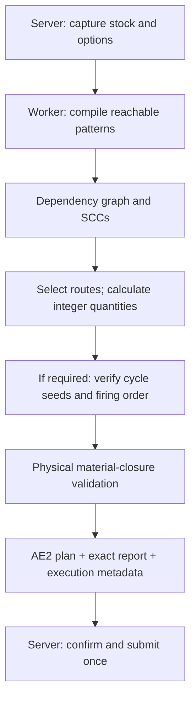

# ECO planner: model, execution, and diagnostics

[API guide](API.md) · [简体中文](ECO_PLANNER_ZH_CN.md) · [Documentation index](README.md)

This document describes the planner in the current 1.21.1 source tree. It is an implementation guide for integrations and maintainers, not a promise that every detail is stable across NeoECOAE releases.

## 1. What the planner does

ECO receives an AE2 goal key and a positive amount, captures the network's available stock, and finds an integer firing vector for the reachable physical patterns. It validates AE2's real input/output contract, creates a normal `ICraftingPlan` projection, and retains an exact report plus execution metadata. An exact parent order is a separate submission path.

The planner is deliberately AE-shaped:

- A pattern input is an AE2 input slot with a primary key, amount, substitutions, and an optional returned/container key.
- A pattern can produce multiple outputs. An output only closes a route when that output is actually advertised by a reachable pattern.
- Returned containers and reusable inputs are part of material accounting. A damageable or otherwise changing remainder is not silently treated as free stock.
- Every physical pattern fires an integer number of times. Fractional solutions are rejected.
- A route that has not been indexed by the crafting service is never invented merely because a key name would make the equation balance.

The planner's output is a proposal for the CPU. Inventory reservation, CPU storage reservation, provider acceptance, and final output delivery are later transactions.

## 2. Selecting the route into ECO

There are two routes:

1. **Explicit route:** call `ECOPlanningService.begin` with a grid, action source, goal, amount, calculation strategy, and `ECOPlannerOptions`.
2. **Marked AE2 route:** wrap an existing simulation requester in `ECOPlannerRequester` before calling AE2's calculation service. If AE2 constructs a calculation, ECO's calculation Mixin handles the marked request; another service wrapper may return its own future first.

The AE2 confirmation menu selects the direct route when fast planning is enabled and a formed/online computation host accepts the request source. The flags alone do not intercept all unmarked requests. Both explicit ECO routes keep unsupported cases as ECO diagnostics; they do not automatically switch the request to a native planner.

The route is logged when `debug.calculating.ecoPlanningStageDebug` is enabled. Typical route reasons distinguish an absent ECO service, disabled fast planning, no host accepting the source, and an eligible host. A host existing somewhere on the network is not enough for a player-only or automatic-only request.

Use `ECOPlannerOptions.from(ECOCraftingNetworkSettings.of(grid))` to copy the network defaults. The options captured by one request do not change if the grid setting changes while the calculation is running.

## 3. Calculation lifetime

The following flow describes the main boundaries. Route fallback, startup recovery, and optional joint optimization may revisit component planning.



The public service returns `Future<ICraftingPlan>`. The worker uses the captured inventory for numeric planning and queries the crafting service for structural pattern information. It must not mutate grid stock, CPUs, providers, or jobs. Poll or consume the future on the server thread, recheck access, and submit the exact returned plan.

A planning session reuses its compiled structure and active route selection across amount probes. It does not reuse inventory, firing counts, material allocations, or search budget across separate requests.

`REPORT_MISSING_ITEMS` preserves the full requested amount and returns its report if it cannot execute. `CRAFT_LESS` probes smaller amounts in the same session and can return a successful plan for fewer outputs. Those probes share the snapshot and budget; they do not imply that the original amount was feasible.

## 4. Structural compilation

### 4.1 Reachable closure

`CraftingNetworkCompiler` starts at the goal and follows the inputs of patterns advertised by the AE2 crafting service. It records:

- producers for each key;
- pattern inputs and multipliers;
- all physical outputs and returned outputs;
- keys that the service can emit without a pattern;
- semantic restrictions and integration-provided pattern identities.

Unreachable patterns are outside this request. Within one producer query, equal definitions may be deduplicated. Alternative definitions and output contracts are retained as route candidates; physical-pattern identity also prevents counting the same recipe independently for each coproduct.

### 4.2 Semantic adapters

The compiler normalizes AE2 and optional integration patterns through ordered semantic adapters. The default order detects Thunderbolt, Useless, ExtendedAE Plus, and then the generic AE2 contract when those classes are present. An adapter must identify unsupported or nondeterministic semantics instead of approximating them into `SUCCESS`.

Important normalized facts are matching mode (`EXACT`, `SUBSTITUTION`, `FUZZY`, `UNKNOWN`), execution restrictions, consumed inputs, produced outputs, returned outputs, feedback edges, and whether the pattern is safe for static cycle analysis. Unknown matching, provider-dependent effects, CPU restrictions, and unsafe remainders remain diagnostics or fallback cases.

### 4.3 Inventory snapshot and unlimited sources

`ECOPlannerInventory.capture(grid)` captures the AE2 long view and a separate set of unbounded keys. Creative cells and recognized infinite/exact sources can therefore be used as supply without claiming that a saturated `Long.MAX_VALUE` is a finite stockpile. The unbounded marker is planner-side identity; physical extraction and insertion still go through ME storage. A large finite BigInteger cell is not automatically unlimited. This entry point captures finite availability through AE2's long view, so it does not obtain an arbitrary-precision finite inventory merely because later arithmetic is exact.

## 5. Graph, routes, and the acyclic solve

The compiled dependency graph is condensed into strongly connected components (SCCs). Acyclic components form a topological route. Cyclic components are deferred to the cycle solver when cycle planning is enabled.

For each key with competing producers, route selection chooses a structural producer choice before numeric solving. The choice vector is complete even when an acyclic pass did not consume a cycle-owned key. Numeric selections overlay the structural choices; this prevents a fallback search from silently omitting a deferred cycle node.

The acyclic solver consumes captured stock, reserves pattern firings, emits byproducts, and records material provenance. It can use stored items, network-emittable keys, and selected pattern outputs. It does not mutate the caller's inventory while trying alternate routes.

After the first feasible/diagnostic pass, `JointRouteOptimizer` may search a bounded set of whole-supply-chain combinations. It can combine individually insufficient producers, select a joint multi-output pattern, prefer a cheaper complete chain, and verify the candidate by physical replay. It keeps an already verified result when its improvement budget expires.

## 6. Cyclic components

### 6.1 When cycle planning runs

Cycle planning is opt-in through `ECOPlannerOptions.cyclePlanningEnabled` and the network setting. If the active route is acyclic, no cycle solver is needed. If a required route contains an SCC, `ComponentPlanner` passes the component, its boundary demand, captured stock, external-resource boundary, and shared cancellation/budget to `BoundedCycleSolver`.

Disabling cycle planning does not turn a cycle into a valid DAG. The route selector may try another producer; otherwise the result carries the disabled/unresolved diagnostic. Explicit ECO requests remain on the ECO diagnostic path. An integration may separately choose another planner, but must keep that planner's result and identity distinct.

### 6.2 Material balance

For each pattern in an SCC, the solver derives a sparse transition column from consumed amounts and produced/returned amounts. It solves the integer material balance against:

- initial stock at the component boundary;
- the required final outputs;
- keys that an upstream/downstream DAG component can supply;
- keys that are true external imports;
- startup seed requirements.

The equation is a feasibility and accounting tool, not a license to execute a negative inventory. A candidate must be replayed in an order that respects AE2 inputs. If the equation has a count vector but no valid replay, the route remains unresolved or moves to an ordered proposal search.

### 6.3 Seeds, boundary demand, and startup recovery

A **seed** is the material needed to start a cycle that current stock and active upstream routes do not provide. An **external demand** is a boundary resource that another component can legitimately supply. They are recorded separately.

A startup candidate is only a proposal. ECO verifies real external supply, reruns the route from projected stock, and subtracts held-stock reservations before accepting it. A local deficit in one witness does not prove that every producer route is impossible. The solver reports seed amount and shortfall in the trace, and it returns `MISSING_ITEMS` only when the material result is proven at the relevant boundary.

### 6.4 Returned containers, catalysts, and byproducts

An input with a returned key can form a feedback edge. ECO tracks the returned amount per firing and only treats it as reusable when the semantic adapter proves the unchanged-key contract. Damageable or component-changing returns require the corresponding special-pattern resolver; they cannot be credited as unchanged catalysts by equality of item ID alone.

All outputs are retained in the material ledger. A byproduct can satisfy another demanded component only if the physical pattern was part of the compiled network and its output is actually indexed. No unindexed producer is inferred from an output name. `ECOPlanMaterialValidator` checks the final physical material balance, using reserved initial inputs, emissions, real outputs, and declared remainders. Unreserved network stock cannot close the CPU's plan. A false closure is rejected with `PLAN_MATERIAL_CLOSURE_INVALID`; executable firing order is validated separately.

### 6.5 Compact repeated circuits and ordered execution

When a cycle has a verified firing order, `PatternRun` stores a pattern, count, repeat width, and repetition count. A million identical laps can therefore remain a compact execution description. Repetition is emitted only for a verified non-overlapping, non-nested circuit; it is not a generic compression of unknown pattern semantics.

The resulting schedule contains supplier-to-consumer phases. Execution contracts use `NATIVE`, `PHASED_DAG`, `ORDERED_CYCLE`, `DYNAMIC_CYCLE`, or `BLOCKED`. Schedule phase types are `DAG`, `CYCLE`, and `DYNAMIC_CYCLE`; a blocked contract is an error, not a runnable phase. Ordered cycles preserve verified steps; dynamic cycles carry exact firing counts and their runtime restrictions.

A pure DAG still gets `PHASED_DAG` metadata when ECO ownership requires phase scheduling. A cycle-expected result with an empty/invalid schedule is rejected before submission. Cyclic/exact/phased plans require ECO execution support; the current external-CPU bridge only allows native-safe, long-representable plans on recognized AE2/AdvancedAE CPUs. Planner selection and CPU eligibility are separate.

### Concrete recipe examples

These examples illustrate material semantics. Every recipe must be advertised by the real crafting service.

| Situation | Required behavior |
| --- | --- |
| `iron -> product`, `copper -> product`; stock 6 iron + 4 copper, request 10 products | A verified joint plan can fire the first recipe 6 times and the second 4 times, even though neither route alone suffices. |
| `ore -> ingot + slag`, followed by `ingot + slag -> product` | One physical first recipe supplies both inputs. Charge its input once and do not count its coproduct twice. |
| `mold + ingot -> plate`, returning exactly the unchanged mold | Reserve the working mold; after its return it can serve another firing. Parallel batches still need enough simultaneous working stock. |
| `A + ore -> 2 B`, `B -> A` | One possible lap restores A and adds one B. With no A or B to start, positive net balance alone does not make the loop executable. |
| `A + feed -> 2 A` | A growing recipe needs a first A and feed. Compression cannot invent its startup seed or boundary supply. |

Joint search is bounded and does not guarantee global optimality. Its current improvement cost is the sum of physical pattern firings, not elapsed machine time or energy. Substitution and unsafe state-changing recipes retain their dedicated resolver paths.

## 7. Exact quantities and large orders

Planner arithmetic uses `PlannerAmount`, backed by exact integer values. The public ordinary goal amount, AE2's normal `CraftingPlan`, and many CPU fields remain long-valued, so ECO distinguishes:

- an exact plan whose counts fit AE2 fields;
- `PLANNED_BUT_AMOUNT_UNREPRESENTABLE`, where the theoretical result is valid but a long field cannot carry it;
- `AMOUNT_OVERFLOW`, where a requested arithmetic operation cannot be represented by the planner contract.

An unbounded source is not the same as an unbounded CPU batch. The planner can prove supply from an infinite source while the execution path still needs bounded child batches and long-valued provider receipts.

The current implementation exposes two exact-order submission paths:

| Path | Planning and execution contract |
| --- | --- |
| Parent API: `ECOBigOrderRequest.submit` | Retains the parent's `BigInteger` goal amount. `ECOBigOrderController` repeatedly captures fresh stock, plans bounded long child segments, and credits only completed child delivery. |
| Confirmation menu big-order action | Validates the exact result with `ECOBigOrderAdmission`, then submits `ECOExactCraftingPlan` directly to an ECO CPU. This retains the full task vector and deferred stock/emissions in one exact execution ledger, using long windows for AE2 operations. It does not create the segmented API parent. |

For the parent API, `ECOBigOrderPlanner.search(maximum, bytes, probe)` starts at the requested segment maximum and halves it until a successful plan fits the supplied CPU byte limit. It treats `MISSING_ITEMS` as a material boundary, capacity/representability as a segment-size boundary, and other statuses as fatal for the probe. Halving finds a fitting segment; it does not promise the mathematically largest fitting segment.

The ordinary planner's goal amount is still a positive long. The menu's exact adapter preserves intermediates and task counts beyond long; callers that need a goal amount itself beyond long must pass it through the parent API. See [API calls](API.md), [parent controller](../src/main/java/cn/dancingsnow/neoecoae/crafting/execution/ECOBigOrderController.java), [menu submission](../src/main/java/cn/dancingsnow/neoecoae/mixins/ae2/menu/CraftConfirmMenuMixin.java), and [exact adapter](../src/main/java/cn/dancingsnow/neoecoae/crafting/adapter/ae2/ECOExactCraftingPlan.java).

## 8. Results and diagnostics

### Planning statuses

| Status | Meaning and next action |
| --- | --- |
| `SUCCESS` | The plan passed numeric and material validation. Still recheck CPU/provider acceptance before showing completion. |
| `MISSING_ITEMS` | The solver produced a definite material shortage for the relevant route/stock snapshot. Inspect `exactMissingItems()` and trace. |
| `PARTIAL` | A partial/proposal result exists but is not a complete executable plan. Do not submit as successful. |
| `CYCLE_UNRESOLVED` | Cycle or route search ended without proof, often because a shared budget or memory allowance ended. This is unknown, not missing. |
| `UNSUPPORTED`, `PARTIAL_UNSUPPORTED`, `CYCLE_UNSUPPORTED` | A pattern contract, cycle feature, or execution path is not supported. Inspect the unsupported contract. Explicit ECO requests do not automatically fall back. |
| `CANCELLED` | The caller or external calculation cancelled the request. |
| `AMOUNT_OVERFLOW` | An operation exceeded a checked amount/representation boundary; read the diagnostic instead of treating it as missing. |
| `PLANNED_BUT_AMOUNT_UNREPRESENTABLE` | Exact arithmetic succeeded, but a normal AE2 long field cannot carry the execution vector. Consider a parent order. |
| `INTERNAL_ERROR` | Unexpected implementation failure. Preserve the diagnostic and report the exact artifact/log. |

### Useful trace information

`ECOPlanTrace` contains nodes, edges, components, cycles, and `PlannerDiagnostic` entries. Useful codes include:

- `MISSING`, `UNSUPPORTED_INPUT`, `CANDIDATE_REJECTED`: a concrete route/input was rejected;
- `CYCLE_SOLVED`, `CYCLE_SEED_REQUIRED`, `CYCLE_EXTERNAL_DEMAND_SOLVED`: cycle evidence and boundary accounting;
- `CYCLE_PROVEN_INFEASIBLE_AT_CURRENT_STOCK`: a component-local proof; other startup routes may still work;
- `ROUTE_PROVEN_UNREACHABLE`: the optimistic closure over advertised producers cannot reach the goal;
- `CYCLE_BUDGET_EXHAUSTED`, `ROUTE_SEARCH_BUDGET_EXHAUSTED`: unfinished feasibility search, which is unknown;
- `ROUTE_OPTIMIZATION_BUDGET`: optional improvement stopped; an already verified successful incumbent can still be returned;
- `CYCLE_TOO_COMPLEX`: an optional structural cutoff ended the attempt; memory exhaustion also remains unknown and is reported in cycle details;
- `PLAN_MATERIAL_CLOSURE_INVALID`, `EXECUTION_AMOUNT_UNREPRESENTABLE`, `PROVENANCE_UNATTRIBUTED`: execution-boundary validation.

These are server configuration options. In the generated server TOML, debug fields are under `[debug.calculating]`, while the shared budget fields below are under `[fastPath]`. Enable debug options for stage logs. `ecoPlanningStageDebug` reports route choice and stage duration; `ecoCraftSubmissionDebug` reports plan/CPU selection and submission routing; `ecoDispatchWatchdogDebug` reports dispatch stalls without changing state.

## 9. Budgets, cancellation, and caching

One `Session` shares a cooperative work/time budget across structural discovery, route selection, startup seed recovery, cycle solving, joint optimization, and `CRAFT_LESS` probes. The current server defaults are:

| Config | Default | Scope |
| --- | ---: | --- |
| `ecoPlanningMaxMillis` | 10,000 ms | One request/session budget. |
| `ecoPlanningMaxWork` | 5,000,000 checkpoints | One request/session budget. |
| `ecoPlanningMaxMemoryMiB` | 64 MiB | Estimated retained cycle matrices/states. |

The cycle solver's `CycleSolveLimits` are optional operational cutoffs. Exceeding a cutoff yields `TOO_COMPLEX` or `UNKNOWN_BUDGET`; it is never a missing-material proof. Checkpoints enforce cooperative limits, not a hard deadline interrupting every operation. The exact exposed cancellation may be a `CANCELLED` result or a cancelled/failed Future depending on the entry point; consume it without submission.

`CompiledStructureCache` may reuse a goal's compiled graph and condensation graph when the crafting-service provider revision, cycle flag, and fuzzy-ID set match. It never caches inventory, numeric choices, material reservations, or a completed result. Reuse is disabled while a provider snapshot is unstable. A changed revision invalidates that service's stale entries. Current cache limits are 32 entries and a combined structural weight of 50,000 keys/patterns/edges; these are implementation choices, not addon configuration contracts.

## 10. A low-level session for tests and specialized integrations

The public service is the preferred entry point. A specialized server-side integration or test can use a session directly:

```java
import appeng.api.networking.IGrid;
import appeng.api.stacks.AEKey;
import cn.dancingsnow.neoecoae.api.me.planning.ECOPlannerOptions;
import cn.dancingsnow.neoecoae.crafting.planner.*;
import cn.dancingsnow.neoecoae.crafting.planner.result.ECOPlanningResult;
import java.util.concurrent.Future;

public final class EcoSessionExample {
    // Call on the owning server thread. This low-level route does not check host eligibility.
    public static Future<ECOPlanningResult> begin(IGrid grid, AEKey goal, long amount,
            ECOPlannerOptions options) {
        if (amount <= 0) throw new IllegalArgumentException("Positive amount required");
        var inventory = ECOPlannerInventory.capture(grid);
        var session = new ECOCraftingPlannerService().createSession(
            grid.getCraftingService(), goal, inventory,
            options.cyclePlanningEnabled(), options.ignorePatternSubstitutions(),
            options.fuzzyPlanningItemIds());
        return ECOPlanningExecutor.submit(() -> session.plan(amount, false, () -> {
            if (Thread.currentThread().isInterrupted()) throw new InterruptedException();
        }));
    }
}
```

Do not reuse this session after the provider topology changes, do not mutate its captured inventory, and do not use its result as a substitute for CPU submission validation.

## 11. Debugging by boundary

Record these facts separately:

1. **Route:** Was the request explicit ECO, marked through AE2, or native?
2. **Snapshot:** Which finite and unbounded sources were captured?
3. **Plan:** What status, plan identity, exact materials, components, and diagnostics were produced?
4. **Execution contract:** `NATIVE`, `PHASED_DAG`, `ORDERED_CYCLE`, `DYNAMIC_CYCLE`, or `BLOCKED`.
5. **CPU admission:** Did the selected ECO or external CPU accept the exact plan and storage reservation?
6. **Provider dispatch:** Was the batch fully accepted, cleanly rejected and rolled back, or indeterminate?
7. **Output delivery:** Were physical and virtual outputs claimed and delivered?

A focused planner test or Java compilation confirms source behavior only. A rebuilt JAR, a live server/client run, and a production instance log are separate evidence. Do not describe one as proof of the others.

Sources: [planning service](../src/main/java/cn/dancingsnow/neoecoae/crafting/planner/ECOPlanningService.java), [session implementation](../src/main/java/cn/dancingsnow/neoecoae/crafting/planner/ECOCraftingPlannerService.java), [compiler](../src/main/java/cn/dancingsnow/neoecoae/crafting/planner/compile/CraftingNetworkCompiler.java), [cycle solver](../src/main/java/cn/dancingsnow/neoecoae/crafting/planner/cycle/BoundedCycleSolver.java), [execution result](../src/main/java/cn/dancingsnow/neoecoae/crafting/planner/result/ECOPlanningResult.java), [schedule](../src/main/java/cn/dancingsnow/neoecoae/crafting/planner/result/ECOExecutionSchedule.java).

## 12. Source map and regression references

| Concern | Implementation | Existing regression source |
| --- | --- | --- |
| Mixed routes and coproducts | [joint optimizer](../src/main/java/cn/dancingsnow/neoecoae/crafting/planner/solve/JointRouteOptimizer.java) | [joint route cases](../src/test/java/cn/dancingsnow/neoecoae/crafting/planner/solve/JointRouteOptimizationTest.java) |
| Startup supply and held-stock accounting | [component planner](../src/main/java/cn/dancingsnow/neoecoae/crafting/planner/solve/ComponentPlanner.java), [external demand](../src/main/java/cn/dancingsnow/neoecoae/crafting/planner/solve/ExternalDemandPlanner.java) | [startup recovery](../src/test/java/cn/dancingsnow/neoecoae/crafting/planner/solve/CycleStartupRecoveryTest.java), [reservations](../src/test/java/cn/dancingsnow/neoecoae/crafting/planner/solve/ExternalDemandReservationTest.java) |
| Integer balance and cycle order | [state equation](../src/main/java/cn/dancingsnow/neoecoae/crafting/planner/cycle/CycleStateEquation.java), [bounded solver](../src/main/java/cn/dancingsnow/neoecoae/crafting/planner/cycle/BoundedCycleSolver.java) | [state equation cases](../src/test/java/cn/dancingsnow/neoecoae/crafting/planner/cycle/CycleStateEquationTest.java) |
| Structure reuse | [cache](../src/main/java/cn/dancingsnow/neoecoae/crafting/planner/compile/CompiledStructureCache.java) | [cache cases](../src/test/java/cn/dancingsnow/neoecoae/crafting/planner/compiled/CompiledStructureCacheTest.java) |
| Compressed runtime circuits | [phase scheduler](../src/main/java/cn/dancingsnow/neoecoae/crafting/planner/result/ECOPhaseScheduler.java) | [repeated circuits](../src/test/java/cn/dancingsnow/neoecoae/crafting/execution/ECORepeatedCircuitRuntimeTest.java) |
| Large-order segment selection | [segment planner](../src/main/java/cn/dancingsnow/neoecoae/crafting/planner/ECOBigOrderPlanner.java) | [segment cases](../src/test/java/cn/dancingsnow/neoecoae/crafting/planner/ECOBigOrderPlannerTest.java) |

These links identify behavior specifications in the current source. They are not a claim that the suites or a game instance were run while writing this documentation.
