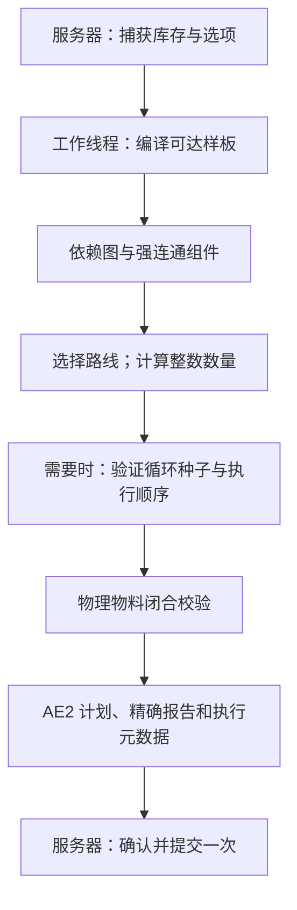

# ECO 规划器：计算模型、执行与诊断

[API 调用指南](API_ZH_CN.md) · [English](ECO_PLANNER.md) · [文档目录](README.md)

本文介绍当前 1.21.1 源码中的规划器，供接入开发者与维护者理解行为，不承诺内部实现跨版本稳定。

## 1. 规划器负责什么

ECO 接收 AE2 目标 Key 和正整数数量，读取网络可用库存，计算可达物理样板的整数执行次数。它校验 AE2 真实输入输出契约，生成普通 `ICraftingPlan` 投影，并保留精确报告和执行元数据。精确父订单使用独立提交入口。

模型围绕 AE2 的实际样板语义构建：

- 每个输入是 AE2 输入槽，包含首选 Key、数量、替代输入和可选的返还或容器 Key。
- 样板可以有多个产物。产物必须由可达样板实际公布，才能形成路线。
- 返还容器与可复用输入参与物料记账。耐久变化或其他状态变化的返还物不能直接算作免费库存。
- 每个物理样板执行整数次，不执行分数次数。
- 合成服务未索引的路线不能仅凭物品名称或方程平衡推测出来。

规划结果是交给 CPU 的方案。初始材料提取、CPU 存储预留、供应器接收和最终产物交付属于后续事务。

## 2. 怎样进入 ECO

有两种入口：

1. **明确调用 ECO：**向 `ECOPlanningService.begin` 传入网络、动作来源、目标、数量、计算策略及 `ECOPlannerOptions`。
2. **标记 AE2 请求：**先将已有模拟请求者包装为 `ECOPlannerRequester`，再调用 AE2 计算服务。AE2 创建计算对象后由 ECO 计算 Mixin 处理；其他服务包装器也可能提前返回自己的 Future。

合成确认菜单在快速规划开启且有已成型、在线并接受该来源的计算主机时，选择直接入口。开关本身不会拦截所有未标记请求。上述两种明确的 ECO 请求遇到不支持的情况都保留 ECO 诊断，不自动改由原版规划器重算。

打开 `debug.calculating.ecoPlanningStageDebug` 后，可以查看路线选择。原因区分没有 ECO 设置、快速规划关闭、没有主机接受该来源以及主机合格。网络中有主机不等于它允许所有请求；玩家专用和机器专用模式会影响资格。

通过 `ECOPlannerOptions.from(ECOCraftingNetworkSettings.of(grid))` 获取默认值。请求已经捕获的选项，不随计算期间的网络开关变化而改变。

## 3. 一次计算的生命周期

下图表示主要边界。替代路线、启动恢复和可选联合优化，可能重新进入组件规划。



公共服务返回 `Future<ICraftingPlan>`。工作线程使用捕获的库存进行数值规划，并从合成服务查询结构信息，不修改网络库存、CPU、供应器或任务。服务器线程读取完成的 Future、重新核对权限，并提交实际返回的计划。

同一规划会话在不同数量探测之间复用编译结构和活动路线选择。不同请求之间不复用库存、执行次数、物料分配或搜索预算。

`REPORT_MISSING_ITEMS` 保留完整请求数量，不能执行时返回其报告。`CRAFT_LESS` 在同一会话中探测较小数量，可能返回产物数量更少的成功计划。探测共享库存快照与预算，不能由此认定原数量可行。

## 4. 结构编译

### 4.1 只编译目标可达范围

`CraftingNetworkCompiler` 从目标开始，沿 AE2 合成服务公布的样板输入追踪依赖，记录：

- 每个 Key 的生产者；
- 样板输入与倍率；
- 全部物理产物及返还产物；
- 合成服务可以直接发出的 Key；
- 语义限制与兼容层提供的样板身份。

本次请求不可达的样板不进入计算。在同一次生产者查询中，相同定义可能被去重；不同定义与产物契约保留为候选路线。物理样板身份也用于避免把同一配方的不同副产物当作相互独立的配方重复计数。

### 4.2 样板语义适配

编译器通过有顺序的语义适配器归一化 AE2 和兼容模组的样板。默认兼容顺序涉及 Thunderbolt、Useless、ExtendedAE Plus，最后使用通用 AE2 契约；可选类型是否存在影响适配器是否启用或识别。适配器必须指出不支持或不确定的语义，不能近似成 `SUCCESS`。

归一化数据包含匹配模式 `EXACT`、`SUBSTITUTION`、`FUZZY`、`UNKNOWN`，执行限制、消耗输入、生产与返还产物、反馈边及静态循环安全证据。未知匹配、依赖供应器的效果、CPU 限制和不安全返还，必须交由相应解析路径或保留诊断。

### 4.3 库存快照与无限来源

`ECOPlannerInventory.capture(grid)` 获取 AE2 的 long 库存视图，并单独保存无限来源 Key 集合。创造盘以及识别到的无限或精确来源，可以作为供应来源，不能仅因显示达到 `Long.MAX_VALUE` 就认定是有限库存或无限资源。

无限标记用于规划语义，实际提取与插入仍经过 ME 存储。大容量有限 BigInteger 盘不会自动成为无限来源。该入口通过 AE2 long 视图读取有限库存，后续使用精确算术并不代表这里已经读取任意精度的有限库存总量。

## 5. 依赖图、路线与无环求解

编译后的依赖图通过强连通分量（SCC）分析压缩为组件图。无环组件形成拓扑路线；需要循环处理的组件，在开关允许时交给循环求解器。

当一个 Key 有多个生产者时，先选择结构路线，再计算具体数量。即使无环阶段没有消费某个循环节点，结构选择向量也必须包含它。数值阶段的实际选择覆盖结构默认选择，避免替代路线搜索漏掉被延后的循环节点。

无环求解器消耗快照库存、记录样板次数、利用副产物，并追踪物料来源。供应包括已存物品、网络可发出的 Key 及已选择样板的产物。尝试替代路线时，不修改调用方库存。

第一轮求解后，`JointRouteOptimizer` 可以在预算内尝试整条供应链的联合方案：合并各自材料不足的生产者、选择同时生产多个输入的配方、改善完整链路成本，并通过实际物理回放验证候选。优化预算耗尽时，已有且验证成功的方案可以继续返回。

## 6. 循环组件

### 6.1 什么时候求解循环

循环规划由 `ECOPlannerOptions.cyclePlanningEnabled` 和网络开关控制。活动路线无环时，不需要循环求解器。如果必需路线含循环组件，`ComponentPlanner` 将组件、目标需求、当前库存、外部资源边界及共享取消和预算传给 `BoundedCycleSolver`。

关闭循环规划不会把循环变成有效 DAG。路线选择器可以尝试其他生产者；仍无法避开时，保留关闭或未解诊断。明确的 ECO 请求继续返回 ECO 诊断。接入方若另选规划器，必须将另一规划器的结果与身份分开处理。

### 6.2 整数物料平衡

求解器为循环中的每个样板建立消耗与生产、返还数量组成的稀疏转换列，结合以下信息计算整数次数：

- 组件边界的初始库存；
- 必需的最终产物；
- 组件图中其他组件能够提供的 Key；
- 真正的外部导入资源；
- 启动种子需求。

方程用于判断数量与记账，不允许执行时库存变负。候选次数还必须按满足 AE2 输入要求的顺序回放。有次数解却没有合法顺序时，仍然属于未解，或者进入有序方案验证路径。

### 6.3 种子、边界需求与启动恢复

**种子**是开始循环所需、但当前库存和活动供应路线没有提供的材料。**外部需求**是允许由其他组件提供的边界资源，两者分别记账。

启动候选只是建议。ECO 核对真实外部供应，以投影库存重新求解，并扣除已经保留的库存后，才接受启动恢复。某一个见证顺序中的缺口，不能证明所有生产者路线都不可行。种子需求和不足量进入诊断，缺材料结论必须在相关边界上有确定的物料依据。

### 6.4 返还容器、催化剂与副产物

输入返还 Key 可以构成反馈边。ECO 追踪每次返还数量，只有语义适配器证明完整 Key 保持不变，才按可复用工作库存处理。耐久或组件变化需要相应的特殊样板解析器，不能仅凭物品 ID 相同就认为是未变化的催化剂。

全部产物进入物料账本。副产物参与其他需求，要求物理配方在已编译网络中且相关输出被实际索引，不能从产物名称猜出未公布的生产者。`ECOPlanMaterialValidator` 按实际输入预留、网络发出、真实产物和声明的返还物检查物料闭合，未预留的网络库存不能弥补 CPU 内的缺口。错误闭合以 `PLAN_MATERIAL_CLOSURE_INVALID` 拒绝；可执行顺序另行验证。

### 6.5 压缩重复循环与执行顺序

存在已验证执行顺序时，`PatternRun` 用样板、次数、重复宽度和重复轮数记录循环。大量相同轮次无需每次创建一个步骤对象。压缩只适用于经过验证、互不重叠且不嵌套的循环，不能压缩成未知样板语义的执行承诺。

调度按供应者到消费者排列阶段。执行契约模式为 `NATIVE`、`PHASED_DAG`、`ORDERED_CYCLE`、`DYNAMIC_CYCLE`、`BLOCKED`；阶段类型则为 `DAG`、`CYCLE`、`DYNAMIC_CYCLE`。阻止执行是错误状态，不是可运行阶段。有序循环保留已验证步骤；动态循环保留精确执行次数和相应运行限制。

纯 DAG 也可能需要 `PHASED_DAG` 元数据。要求循环调度却得到空或无效计划的结果，在提交前被拒绝。循环、精确和阶段计划需要 ECO 执行能力；当前外部 CPU 桥只允许能够安全使用原生执行、数量能放入 long 的计划进入识别到的 AE2 或 AdvancedAE CPU。规划器选择与 CPU 资格是不同判断。

### 具体配方例子

以下用于解释物料语义；每个配方都必须由实际合成服务公布。

| 场景 | 应有行为 |
| --- | --- |
| `铁 -> 成品`、`铜 -> 成品`；库存 6 铁和 4 铜，需要 10 成品 | 合格的联合计划可以分别执行 6 次和 4 次，不能仅因单条路线不足就忽略合并方案。 |
| `矿石 -> 锭 + 炉渣`，随后 `锭 + 炉渣 -> 成品` | 前一个物理配方同时提供两个输入，只扣一次矿石，不能重复计算副产物。 |
| `模具 + 锭 -> 板`，完整返还原模具 | 预留工作模具，返还后可以再用；并行批次仍需要足够的同时工作库存。 |
| `A + 矿石 -> 2 B`、`B -> A` | 一种合法轮次可以恢复 A 并增加一个 B；没有 A 或 B 启动时，仅净增长不构成可执行证明。 |
| `A + 原料 -> 2 A` | 增殖配方仍需要首个 A 与原料，压缩不会生成启动种子或外部供应。 |

联合搜索有预算限制，不保证全局最优。当前优化成本是物理样板执行次数总和，不是机器耗时或能耗。替代输入及不安全的状态变化配方保留各自的解析路径。

## 7. 精确数量与大订单

规划算术使用 `PlannerAmount` 保存精确整数。普通入口的目标数量、AE2 `CraftingPlan` 及多个 CPU 字段仍为 long，因此区分：

- 次数和数量可以放入 AE2 字段的精确方案；
- `PLANNED_BUT_AMOUNT_UNREPRESENTABLE`：理论方案已算出，但 long 执行字段装不下；
- `AMOUNT_OVERFLOW`：某次操作越过了被检查的数量或表示边界。

无限来源不等于无限大小的 CPU 批次。规划器能够证明无限来源供应，执行路径仍可能需要有界子批次和 long 供应器回执。

当前实现有两种精确订单提交路径：

| 路径 | 规划与执行约定 |
| --- | --- |
| 父订单 API：`ECOBigOrderRequest.submit` | 保存父订单的 `BigInteger` 目标数量。`ECOBigOrderController` 根据新库存反复规划有界 long 子段，只在子段完成交付后累计完成量。 |
| 确认菜单的大订单操作 | 使用 `ECOBigOrderAdmission` 校验精确结果，再将 `ECOExactCraftingPlan` 直接提交给 ECO CPU。一个精确执行账本保留完整任务向量及延后库存、发射数量，以 long 窗口执行 AE2 操作；不创建 API 的分段父订单。 |

父订单 API 中，`ECOBigOrderPlanner.search(maximum, bytes, probe)` 从指定子段上限开始，不断减半，直到成功计划适合 CPU 字节上限。它将缺材料与容量、表示范围分别处理，其他状态视为本次探测的致命失败。减半找到能执行的段，不保证得到数学意义上最大的可执行段。

普通规划入口的目标数量仍是正 long。菜单精确适配器保存超过 long 的中间数量和任务次数；目标数量本身超过 long 时，调用方需要使用父订单 API。参见 [API 调用](API_ZH_CN.md)、[父订单控制器](../src/main/java/cn/dancingsnow/neoecoae/crafting/execution/ECOBigOrderController.java)、[菜单提交](../src/main/java/cn/dancingsnow/neoecoae/mixins/ae2/menu/CraftConfirmMenuMixin.java)及[精确适配器](../src/main/java/cn/dancingsnow/neoecoae/crafting/adapter/ae2/ECOExactCraftingPlan.java)。

## 8. 结果与诊断

### 规划状态

| 状态 | 含义与处理 |
| --- | --- |
| `SUCCESS` | 通过数值和物料校验；仍需检查 CPU 与供应器接收，不能直接视为任务完成。 |
| `MISSING_ITEMS` | 在相关路线和库存快照上得到确定缺口，读取 `exactMissingItems()` 与诊断。 |
| `PARTIAL` | 有部分或候选结果，但没有完整可执行计划，不能按成功提交。 |
| `CYCLE_UNRESOLVED` | 循环或路线搜索未完成证明，可能是时间、工作或内存预算耗尽；表示未知，不是缺材料。 |
| `UNSUPPORTED`、`PARTIAL_UNSUPPORTED`、`CYCLE_UNSUPPORTED` | 样板契约、循环能力或执行路径不支持；查看具体原因，明确 ECO 请求不会自动回退。 |
| `CANCELLED` | 调用方或外部候选计算取消请求。 |
| `AMOUNT_OVERFLOW` | 超过被检查的数量或表示边界；按诊断处理，不等同于材料不足。 |
| `PLANNED_BUT_AMOUNT_UNREPRESENTABLE` | 精确计算成功，普通 AE2 long 字段无法保存执行数量，可考虑父订单。 |
| `INTERNAL_ERROR` | 实现中的非预期失败，保留诊断并提供实际产物和日志。 |

### 常用诊断信息

`ECOPlanTrace` 包含节点、边、组件、循环和 `PlannerDiagnostic`。常见代码：

- `MISSING`、`UNSUPPORTED_INPUT`、`CANDIDATE_REJECTED`：具体输入或路线拒绝原因；
- `CYCLE_SOLVED`、`CYCLE_SEED_REQUIRED`、`CYCLE_EXTERNAL_DEMAND_SOLVED`：循环证据和边界记账；
- `CYCLE_PROVEN_INFEASIBLE_AT_CURRENT_STOCK`：组件局部证明，其他启动路线仍可能可行；
- `ROUTE_PROVEN_UNREACHABLE`：所有已公布生产者的乐观闭包仍无法达到目标；
- `CYCLE_BUDGET_EXHAUSTED`、`ROUTE_SEARCH_BUDGET_EXHAUSTED`：可行性搜索没完成，不能给出全局缺材料结论；
- `ROUTE_OPTIMIZATION_BUDGET`：可选优化停止，已有且验证成功的方案仍可返回；
- `CYCLE_TOO_COMPLEX`：可选结构上限终止求解；内存耗尽也保持未知，具体原因查看循环诊断；
- `PLAN_MATERIAL_CLOSURE_INVALID`、`EXECUTION_AMOUNT_UNREPRESENTABLE`、`PROVENANCE_UNATTRIBUTED`：执行边界校验信息。

这些是服务器配置。生成的服务器 TOML 中，调试字段位于 `[debug.calculating]`，下节预算字段位于 `[fastPath]`。`ecoPlanningStageDebug` 输出路线和阶段耗时；`ecoCraftSubmissionDebug` 输出计划、CPU 选择和提交路由；`ecoDispatchWatchdogDebug` 记录发配停滞，不修改状态。

## 9. 预算、取消与缓存

一个 `Session` 共享协作式时间和工作预算，覆盖结构发现、路线选择、种子恢复、循环求解、联合优化及 `CRAFT_LESS` 探测。当前默认值：

| 配置 | 默认值 | 范围 |
| --- | ---: | --- |
| `ecoPlanningMaxMillis` | 10,000 毫秒 | 一次请求或会话。 |
| `ecoPlanningMaxWork` | 5,000,000 个检查点 | 一次请求或会话。 |
| `ecoPlanningMaxMemoryMiB` | 64 MiB | 循环矩阵和搜索状态的保留内存估算。 |

`CycleSolveLimits` 是可选操作上限，超限返回 `TOO_COMPLEX` 或 `UNKNOWN_BUDGET`，不构成缺材料证明。检查点是协作限制，不是能强行中断每个操作的硬时限。根据入口不同，取消可能表现为 `CANCELLED` 结果，或取消、失败的 Future；都不应继续提交。

`CompiledStructureCache` 在合成服务身份、供应器修订号、目标、循环开关和模糊 ID 集合一致时，复用目标编译结构和组件图，不缓存库存、数值选择、材料预留或完成结果。供应器快照不稳定时禁用复用；修订号改变后移除该服务的旧条目。当前最多 32 条，总结构权重最多 50,000 个 Key、样板和边；这些是实现参数，不是附属模组配置契约。

## 10. 测试与特殊接入使用低层会话

正常接入优先使用公共规划服务。特殊服务器接入或测试，可以直接创建会话：

```java
import appeng.api.networking.IGrid;
import appeng.api.stacks.AEKey;
import cn.dancingsnow.neoecoae.api.me.planning.ECOPlannerOptions;
import cn.dancingsnow.neoecoae.crafting.planner.*;
import cn.dancingsnow.neoecoae.crafting.planner.result.ECOPlanningResult;
import java.util.concurrent.Future;

public final class EcoSessionExample {
    // Call on the owning server thread. This low-level route does not check host eligibility.
    public static Future<ECOPlanningResult> begin(IGrid grid, AEKey goal, long amount,
            ECOPlannerOptions options) {
        if (amount <= 0) throw new IllegalArgumentException("Positive amount required");
        var inventory = ECOPlannerInventory.capture(grid);
        var session = new ECOCraftingPlannerService().createSession(
            grid.getCraftingService(), goal, inventory,
            options.cyclePlanningEnabled(), options.ignorePatternSubstitutions(),
            options.fuzzyPlanningItemIds());
        return ECOPlanningExecutor.submit(() -> session.plan(amount, false, () -> {
            if (Thread.currentThread().isInterrupted()) throw new InterruptedException();
        }));
    }
}
```

拓扑变化后，不继续复用旧会话；不修改捕获的库存。消费 Future 的方法与 API 指南一致，只在完成后读取，并在服务器线程校验和提交实际的 `result.plan()`。`status()`、`executionPlanError()` 和 `executionContract()` 可以解释结果，但不能代替 CPU 准入校验。

## 11. 按阶段排查

分别记录以下事实：

1. **入口：**明确 ECO、AE2 标记请求，还是其他或原版规划器？
2. **快照：**读取了哪些有限库存和无限来源？
3. **计划：**状态、身份、精确物料、组件和诊断是什么？
4. **执行契约：**`NATIVE`、`PHASED_DAG`、`ORDERED_CYCLE`、`DYNAMIC_CYCLE`，还是 `BLOCKED`？
5. **CPU 准入：**CPU 是否接受实际计划及存储预留？
6. **供应器发配：**整批接收、明确拒绝并回滚，还是接收状态不确定？
7. **产物交付：**物理和虚拟产物是否完成认领与交付？

定向规划测试或 Java 编译只能说明源码层面的检查。重建 JAR、实际客户端或服务器运行、生产实例日志分别提供不同证据，不能相互替代。

源码：[公共服务](../src/main/java/cn/dancingsnow/neoecoae/crafting/planner/ECOPlanningService.java)、[会话实现](../src/main/java/cn/dancingsnow/neoecoae/crafting/planner/ECOCraftingPlannerService.java)、[结构编译器](../src/main/java/cn/dancingsnow/neoecoae/crafting/planner/compile/CraftingNetworkCompiler.java)、[循环求解器](../src/main/java/cn/dancingsnow/neoecoae/crafting/planner/cycle/BoundedCycleSolver.java)、[规划结果](../src/main/java/cn/dancingsnow/neoecoae/crafting/planner/result/ECOPlanningResult.java)、[执行调度](../src/main/java/cn/dancingsnow/neoecoae/crafting/planner/result/ECOExecutionSchedule.java)。

## 12. 源码导航与回归用例

| 关注点 | 实现 | 已有回归源码 |
| --- | --- | --- |
| 混合路线与多产物 | [联合优化](../src/main/java/cn/dancingsnow/neoecoae/crafting/planner/solve/JointRouteOptimizer.java) | [联合路线用例](../src/test/java/cn/dancingsnow/neoecoae/crafting/planner/solve/JointRouteOptimizationTest.java) |
| 启动供应与保留库存 | [组件规划](../src/main/java/cn/dancingsnow/neoecoae/crafting/planner/solve/ComponentPlanner.java)、[外部需求](../src/main/java/cn/dancingsnow/neoecoae/crafting/planner/solve/ExternalDemandPlanner.java) | [启动恢复](../src/test/java/cn/dancingsnow/neoecoae/crafting/planner/solve/CycleStartupRecoveryTest.java)、[预留记账](../src/test/java/cn/dancingsnow/neoecoae/crafting/planner/solve/ExternalDemandReservationTest.java) |
| 整数平衡与循环顺序 | [状态方程](../src/main/java/cn/dancingsnow/neoecoae/crafting/planner/cycle/CycleStateEquation.java)、[有界求解器](../src/main/java/cn/dancingsnow/neoecoae/crafting/planner/cycle/BoundedCycleSolver.java) | [方程用例](../src/test/java/cn/dancingsnow/neoecoae/crafting/planner/cycle/CycleStateEquationTest.java) |
| 结构复用 | [缓存](../src/main/java/cn/dancingsnow/neoecoae/crafting/planner/compile/CompiledStructureCache.java) | [缓存用例](../src/test/java/cn/dancingsnow/neoecoae/crafting/planner/compiled/CompiledStructureCacheTest.java) |
| 压缩循环运行 | [阶段调度](../src/main/java/cn/dancingsnow/neoecoae/crafting/planner/result/ECOPhaseScheduler.java) | [重复循环用例](../src/test/java/cn/dancingsnow/neoecoae/crafting/execution/ECORepeatedCircuitRuntimeTest.java) |
| 大订单子段选择 | [子段规划](../src/main/java/cn/dancingsnow/neoecoae/crafting/planner/ECOBigOrderPlanner.java) | [子段用例](../src/test/java/cn/dancingsnow/neoecoae/crafting/planner/ECOBigOrderPlannerTest.java) |

这些链接标明当前源码中的行为约定，不代表编写文档时已经运行相应测试套件或游戏实例。
