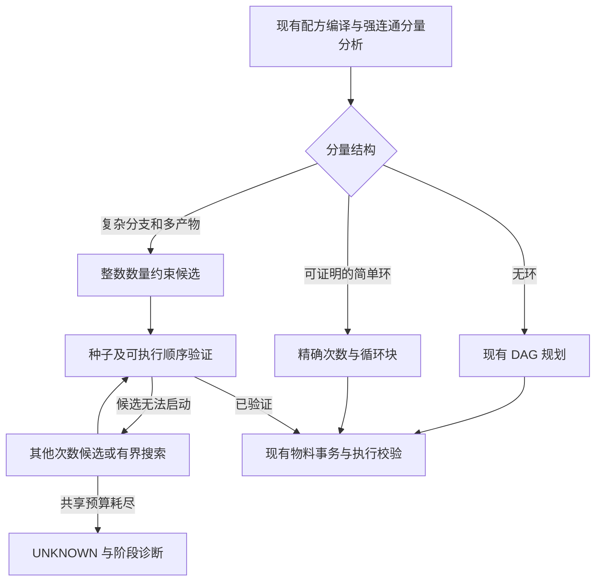

循环合成规划：开源方案对照与改进建议

调研日期：2026-09-25。范围覆盖“有解却规划不出”“大订单规划耗时”“种子、催化剂和副产物处理”。本文是源码层面的分析与设计建议，未通过游戏实测或性能基准证明具体提速幅度，也没有改动规划器实现。

已先更新远端引用。NeoECO 当前分支相对 origin/v21.1.2 领先 1 个提交、落后 0 个提交，阅读基线为 `154c5bff`。工作区已有其他修改。Thunderbolt-Core 阅读版本与最新 upstream/main 一致；AE2-VM 与 origin/main 一致。新增参考源码位于 `E:/Minecraft Project/_comparison_sources/`。

最值得参考的组合是：Thunderbolt 的数量求解与启动证明分离，Factorio Calculator 的简单路径与约束求解分流，以及经过执行条件验证的整段循环压缩。保留本项目现有的物料事务、精确计数、执行顺序校验和 UNKNOWN 状态。

| 参考项目及阅读版本 | 已核实的实现 | 对 NeoECO 的价值与边界 |
| --- | --- | --- |
| [Thunderbolt-Core](https://github.com/ae2lt/Thunderbolt-Core/tree/27743fb8ce952669b83efe30ba08e7f8a56cbd68) | `CpSatRankedFlowSolver` 用整数执行次数、激活变量、依赖秩和启动前缀证明；对已识别的守恒转换与部分非增长副产物反馈环做特殊处理；催化剂有存在性条件 | 最贴近 AE 的参考。可以借鉴结构分类、种子预留和紧凑证明，但不能把其支持的有限循环类别理解为任意 Petri 网都能快速求解 |
| [Factorio Calculator](https://github.com/KirkMcDonald/kirkmcdonald.github.io/tree/349ebfb5f0fe09145169b4b47bc1771f55c1a896) | `cycle.js` 识别强连通分量；`solve.js` 先递归解决简单部分，再构建投入产出矩阵调用 simplex；采用有理数运算 | 适合借鉴配方平衡、多产物和优先级建模。它主要计算生产速率，不能直接提供有限库存下的整数执行顺序与启动保证 |
| [FactorioLab](https://github.com/factoriolab/factoriolab/tree/3709b0682893e812db365dd31b3d2bb5ef35a6f1) | `src/solver/solver.ts` 用 GLPK 建模配方变量、输入上限、净输出、剩余物料与成本；区分求解返回码和状态 | 适合参考统一约束模型和诊断。当前这些配方变量是连续变量；换到 AE 必须补整数次数、精确复核和执行可达性 |
| [AE2-VM](https://github.com/TaoLe-si/AE2-VM/tree/2248e483ea8cef781c480279517c9d76bf1e9aa3) | `CraftingVM` 将子树效果保存为 Bundle，并按次数缩放；递归重入时处理现有库存 | 可参考汇总效果与批量复用。该机制本身不构成通用循环可达性算法，也不证明任意循环的种子需求可以线性放大 |

关键源码入口：

- [Thunderbolt 数量求解与启动证明](https://github.com/ae2lt/Thunderbolt-Core/blob/27743fb8ce952669b83efe30ba08e7f8a56cbd68/src/main/java/com/moakiee/thunderbolt/core/crafting/planner/CpSatRankedFlowSolver.java)
- [Thunderbolt 大数量与复杂循环用例](https://github.com/ae2lt/Thunderbolt-Core/blob/27743fb8ce952669b83efe30ba08e7f8a56cbd68/src/test/java/com/moakiee/thunderbolt/core/planner/CpSatComplexCycleAdversarialTest.java)（本次阅读了用例，未运行这些测试）
- [Factorio Calculator 的矩阵求解入口](https://github.com/KirkMcDonald/kirkmcdonald.github.io/blob/349ebfb5f0fe09145169b4b47bc1771f55c1a896/solve.js#L128)
- [FactorioLab 的约束模型](https://github.com/factoriolab/factoriolab/blob/3709b0682893e812db365dd31b3d2bb5ef35a6f1/src/solver/solver.ts#L355)
- [AE2-VM 的 Bundle](https://github.com/TaoLe-si/AE2-VM/blob/2248e483ea8cef781c480279517c9d76bf1e9aa3/src/main/java/com/ae2vm/addon/vm/CraftingVM.java#L67)

当前实现中能够直接确认的限制：

1. **交替循环的计划大小仍依赖订单数量。** `BoundedCycleSolver.exactRingWitness` 在循环中逐段追加 BatchFiring，`appendBatch` 只合并相邻同一配方；`PatternRun` 也只表示一个配方重复多少次。对只有一个 A 种子的 `A + fuel → B; B → A + product`，生成 N 个产品需要约 2N 个交替段，即使执行次数早已算出。确定性环路径还有 1,000,000 次外层迭代上限。因此，大数量问题不只发生在搜索，也发生在证明和计划的物化阶段。
2. **通用搜索仍可能遭遇状态爆炸。** 现有确定性环快速路径之外，是有界库存状态搜索，加上 Top-K 与两层前瞻的贪心探测。默认状态上限 100,000，大分量上限 1,000,000。代码保留单次执行边，预算耗尽返回 UNKNOWN；这避免了把未搜完谎报成无解，但不能保证复杂可行订单能在预算内找到解。
3. **种子建议只沿一个选定方向扩张。** `Search.considerUnblock` 保存一个解除阻塞的缺口向量，偏好直接产出目标的配方，再比较缺口总量；后续 seed ladder 只倍增这个向量。它没有搜索多个互不支配的种子组合。已有的外部启动恢复和替代路线机制能够补救部分情况，但该局部估计仍不等于全局最小、最容易获得或充分的种子集合。
4. **路线重试可能放大局部求解成本。** `ComponentPlanner.planWithCycleFallback` 最多尝试 256 个路线组合，虽有请求级循环失败缓存，不同数值请求仍可能各自承担一份循环求解预算。`CycleSolveLimits` 表达的是局部规模、状态和步数上限，不是整单共享的耗时与内存预算。需要把外部 DAG、路线切换、循环搜索与计划物化一起计费。

以上是结构性限制，不能据此断言用户的具体配方已经发生了某一类错误。现有测试也已覆盖有限燃料、无关副产物、内部中间物积累和部分随机小环；改进时应继续保留这些保障。

建议的执行流程：



**第一阶段：整段循环的精确表示。** 增加能表达 `Repeat(Sequence(Run(P1,1), Run(P2,1)), N)` 的计划节点或等价循环证书。只压缩已经验证的固定顺序，不把所有配方次数直接相乘后丢掉顺序。执行器、持久化、恢复、材料预留和图快照都必须消费紧凑表示，避免下游再次展开。

固定顺序块可以用两个向量概括：最小启动库存 `r` 与净变化 `d`。对普通确定性配方，串接块 X、Y 的精确摘要为：

```text
d(X;Y) = d(X) + d(Y)
r(X;Y) = max(r(X), r(Y) - d(X))       // 各物料逐项计算
r(X repeated N) = r(X) + max(0, -(N-1) * d(X)), N >= 1
```

这些公式适用于已确定顺序、固定投入产出的块。容器、耐久、替代品和专用库存必须先规范化其语义；外部输入必须实际预留或有已验证供应计划，不能作为无限免费库存。计算采用现有精确数量类型。它压缩的是规划证明与元数据，实际机器仍然需要完成 N 轮加工。

**第二阶段：多个种子候选和共享预算。** 保留一组互不支配的启动缺口，结合真实库存和外部可生产性选候选；不要直接把物品个数与流体数量相加当成通用成本。每个建议明确标注“解除一步阻塞的估计”或“已验证足以完成订单”。全规划共享工作量、内存及截止时间预算，并保留取消检查；跨路线重试不重置整单额度。

**第三阶段：复杂环的整数约束后端。** 为配方执行次数 `x` 建立必要的物料平衡：`stock + (outputs-inputs) * x + imports >= demand`，其中 `x` 是非负整数，imports 来自可用外部供应。该方程只是候选生成条件。候选必须继续通过非负库存与启动验证；一个候选不可调度，不能证明所有其他候选都不可行。LP 松弛可用于下界或搜索指引；ILP/CP-SAT 用于整数候选。后端的数值范围与本项目超 long 数量需求需要单独适配，不直接截断大数。

不能只换成 simplex 就宣布循环问题解决。例如 `A → B; B → A + P` 在零 A、零 B 时，平衡方程允许两个配方各执行一次并产出 P，但游戏中第一步就无法执行。更强的数量求解器必须与启动证明配套。

验证应优先覆盖：单种子交替环的百万至万亿级请求、存在多个种子路线但仅一路可取得、有限燃料恰好够用、多个目标争抢同一催化剂、副产物作为唯一启动来源、空种子却平衡有解、负净增长循环、取消与预算耗尽。小规模实例继续与独立逐次执行 oracle 对照；性能同时记录状态数、循环计划节点数、精确次数、峰值内存和耗时，不只看成功率。

推荐实施顺序为“整段循环压缩 → 种子候选与整单预算 → 复杂环整数求解”。这能先消除确定性的大订单线性膨胀，再扩大复杂分支的求解能力。现有有界搜索继续作为受预算约束的后备路径。
